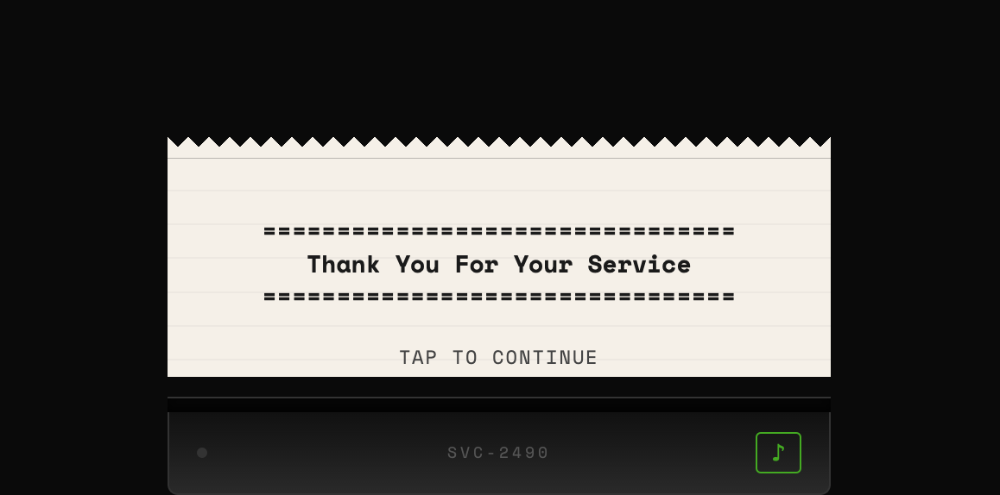

I left a job recently. Three years, give or take. A bunch of nights after, I was sitting at a bar thinking about how I'd explain the whole thing to the person behind the counter. Not the version with tech words and terms I use at work - the version that would make sense to someone who works in a restaurant.

How the kitchen ran. Who got to change the menu. What happened when you proposed something, and what happened when someone else proposed the exact same thing without asking.

[**Play it here.**](/games/thank-you-for-your-service/)

# Why a receipt

The whole game is one long receipt printing out of a thermal printer. You tap, the next line prints. There are choices sometimes.[^choices]

Receipts are also just a really good format for this kind of story. They don't have opinions. They record transactions: what was given, what was received, how long it took, what it cost. The gap between the numbers on a receipt and the experience they represent is where the whole game lives.

# The printer

I wanted it to feel like a physical thing, not a web page with text on it. There's a CSS thermal printer at the bottom of your screen with a slot, a status light, and a little model number.[^model] Paper feeds upward as you tap, with that jerky `steps()` CSS timing that thermal paper actually has. The sound is Web Audio API, a bandpass-filtered noise burst for the print head and a low-frequency rumble for the paper feed, both synthesized on the fly so there's no audio file to load.

When you open the game, the screen is empty. Just the printer sitting at the bottom in a dark void. First tap and a small strip of paper appears. It grows as you go, and when there's more paper than screen, it starts scrolling. Lines print one by one within each section, and if you get impatient you can tap again to skip to the end of the current block.[^skip]

I won't spoil what happens at the end, but the printer does something different. You'll know when it's over.

# What I won't say

If you've worked somewhere like this, you'll recognize it. If you haven't, maybe you'll understand something about what it's like, and consider yourself lucky.

The numbers at the end are real, by the way. All of them.[^numbers]

---

[Play Thank You For Your Service](/games/thank-you-for-your-service/)

[^choices]: Play it and see if they do anything. Don't blame the receipt printer, it's just a messenger.
[^model]: A completely random model number, of course. I was tempted to use 69 in there but I'm a responsible raccoon.
[^skip]: But you wouldn't do that, now would you?
[^numbers]: Every single one. The game is fiction in the same way receipts are fiction: everything on them actually happened, they're just printed on different paper. Plus, I worked at a place where numbers mattered.
